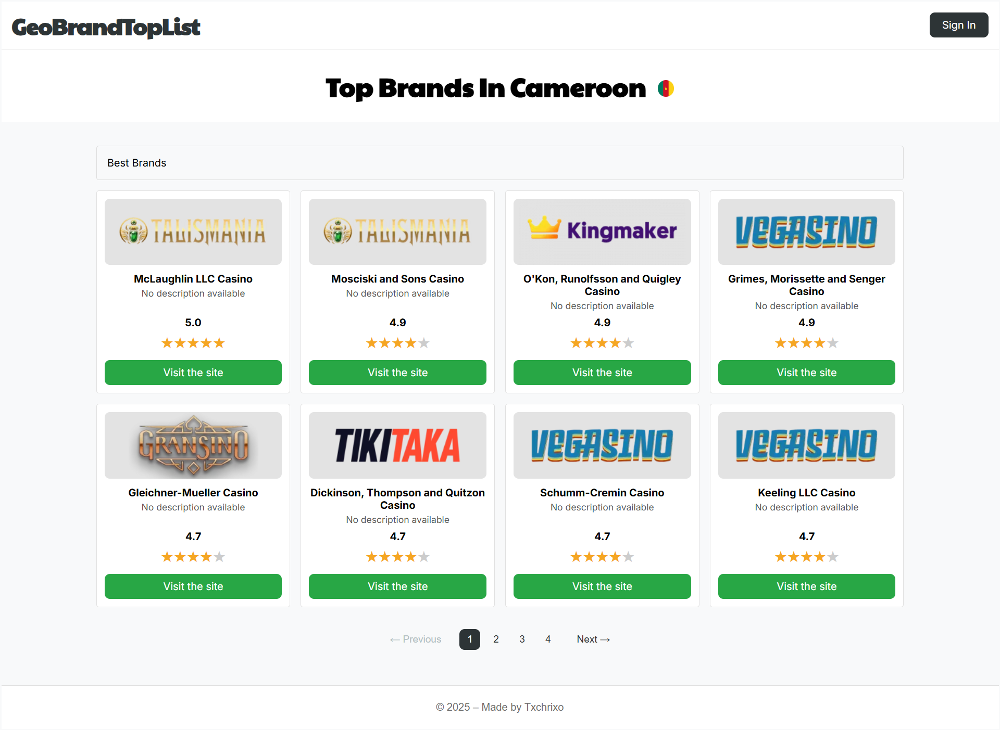
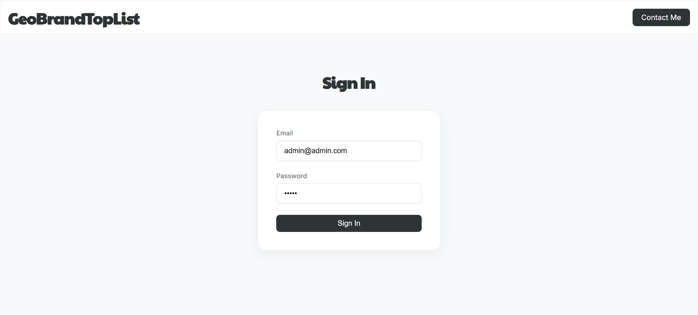
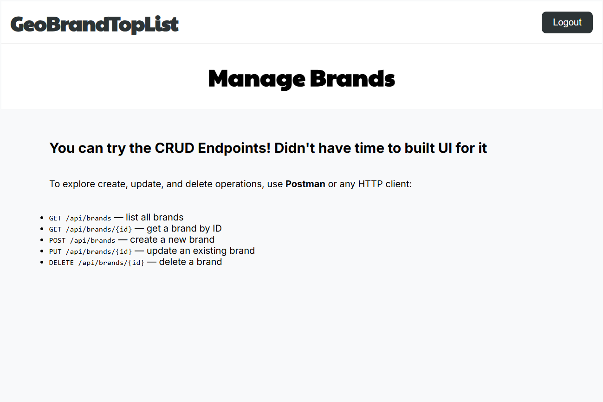
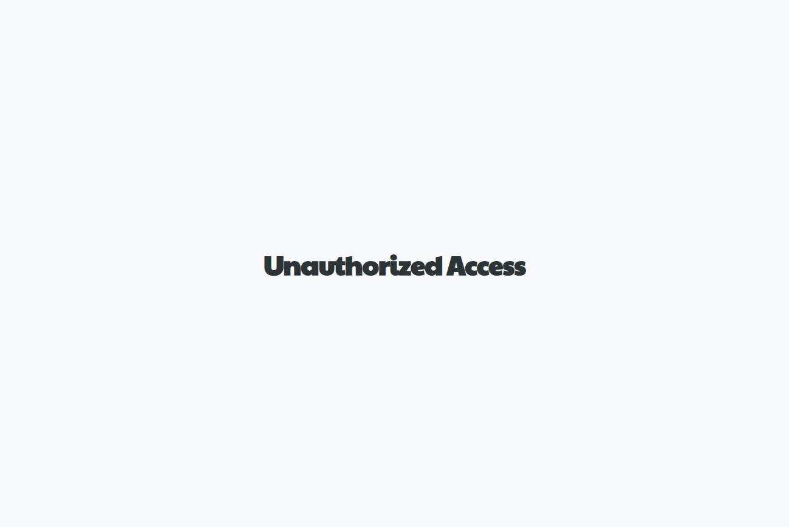

# GeoBrandTopList

## Demo Screenshots

| Index | Login |
|--------------|-------------|
|  |  |

| Dashboard | Unauthorized |
|-----------|----------------------|
|  |  |

## Figma Design

[UI view on Figma](https://www.figma.com/design/HKdFyXD48Wa4srhPkbt8GC/GeoBrandTopList-UI?node-id=0-1&m=dev&t=pN8PM1sEBg4r0glN-1)  

## Prerequisites

- **Docker**
- **Modern web browser** (Chrome, Firefox, Safari…)

## Quick Project Structure

- **api/**            Laravel backend REST API
- **web/**            Frontend (HTML/CSS/JS)
- **docker/nginx/**   Nginx reverse proxy 
- **docs/images/**    Screenshots 
- **docker-compose.yml**

## Running the project

1. Copy the example environment file:
   ```
   cp api/.env.example .env
   ```

1. **Start services** from the project root:

   ```bash
   docker compose up -d
   ```

2. Generate the application key:
   ```bash
   docker exec -it geobrand-api php artisan key:generate
   ```

2. **Run migrations and seeders** (only once):

   ```bash
   docker exec -it geobrand-api php artisan migrate --seed
   ```

3. **Open your browser** at:

   ```
   http://localhost:5500/
   ```

4. **Login credentials**:

   - Email: `admin@admin.com`
   - Password: `admin`


## CRUD via cURL or Postman

You can test the API endpoints using tools like Postman or cURL. Make sure your backend is running (via `php artisan serve` on port 7000) and accessible. To check it try a http://localhost:7000/api/health request first.

## Stopping and Cleaning Up

To stop containers and remove volumes (frontend + DB):
  docker compose down -v

To restart:
  docker compose up -d

## Notes / Improvements

- Use `pnpm` to manage the overall monorepo
- Implement a proper and responsive dashboard view
